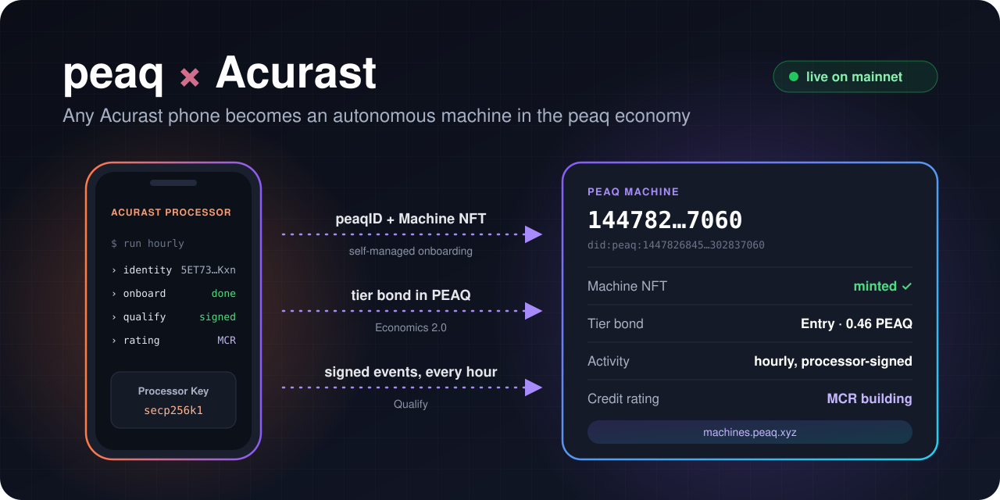

# peaq × Acurast: autonomous machines on decentralized compute

<p align="center">
  
</p>

**A proof of concept that turns an [Acurast](https://acurast.com) Processor into an
autonomous machine in the [peaq](https://www.peaq.xyz) machine economy, live on mainnet.**

Acurast runs compute on tens of thousands of smartphones around the world. peaq gives machines
an on-chain identity, an economy and a credit rating. Put them together, and any phone in the
Acurast network can become a machine that joins peaqOS, bonds PEAQ, and builds a verifiable
activity record, with no server to run.

- 📱 **Acurast Processor**: runs the machine logic on a schedule, with a device identity and a job
  key provided by the Acurast runtime.
- 🤖 **peaqOS Economics 2.0**: gives the machine a peaqID (DID), a Machine NFT, a tier bond, an
  event registry and a Machine Credit Rating (MCR).

## See it live

A processor running this code joined peaq mainnet on September 27, 2026, and reports in every hour.

| | |
|---|---|
| 🔎 Machine Explorer | [machine 144782…7060](https://machines.peaq.xyz/machine/1447826845192839801136966571167551964934786601598145303834417409205302837060) |
| 🪪 peaqID | `did:peaq:1447826845192839801136966571167551964934786601598145303834417409205302837060` |
| 📈 Machine Credit Rating | [mcr-20.peaq.xyz](https://mcr-20.peaq.xyz/mcr/did:peaq:1447826845192839801136966571167551964934786601598145303834417409205302837060) |
| 👛 Machine wallet | [0x5942F713fD160243396562246696E4aF9355D0A9](https://peaq.subscan.io/account/0x5942F713fD160243396562246696E4aF9355D0A9) |
| 📱 Acurast Processor | `5ET73nbCbRYuCjZry1mXxm7uiyAMPXkQtLqUAyLT7t1rMKxn` |

## How it works

On every run, the processor:

1. **Finds its identity.** It derives its peaq machine ID from its own Acurast device address.
2. **Joins peaqOS.** If it is not a peaq machine yet, it onboards itself following
   [self-managed onboarding](https://docs.peaq.xyz/peaqos/guides/self-managed-onboarding):
   peaqID, Machine NFT and tier bond.
3. **Qualifies.** It submits a signed activity event to the Economics 2.0 EventRegistry
   ([Qualify](https://docs.peaq.xyz/peaqos/functions/qualify)).
4. **Checks its rating.** It reads its current Machine Credit Rating.

Every step is idempotent, so each run picks up exactly where the machine stands.

```
 your computer (owner)                        Acurast Processor (phone)
 ─────────────────────                        ─────────────────────────
 OWNER_PRIVATE_KEY  (stays local)             MACHINE_PRIVATE_KEY  (encrypted env var)
 npm run owner keygen    ── .env ──────────▶  dist/bundle.js, hourly:
 npm run owner 2fa-*                            computeMachineId(type, "acurast:<device>")
 npm run owner fund <totp> ─ gas ─┐             activateMachine()   first run
 npm run owner topup  ── bond ────┤             submitEvent()       signed via _STD_.signers
                                  ▼             queryMcr()
                          machine wallet (peaq EVM)
```

### Identity and trust

- **Machine ID from the processor.** The ID is `computeTokenId(machineType, credentialSubject)` on
  peaq's MachineRegistry. `credentialSubject` is `"acurast:" + <device address>`, so every
  processor gets its own, stable machine ID across runs and redeployments.
- **Machine wallet in control.** The machine wallet (`MACHINE_PRIVATE_KEY`) owns the Machine NFT,
  controls the DID, holds the bond and submits the events. The Acurast CLI delivers it to the
  processor as an encrypted environment variable.
- **Processor key in the DID.** The DID document publishes the processor's job key as
  `#acurast-processor`, next to service endpoints naming the Acurast device and deployment.
- **Signed events.** Each event's data hash is signed with that key through
  `_STD_.signers.secp256k1`. The signature travels in the event's `metadata`
  (`{alg, key:"#acurast-processor", pub, sig}`), so anyone can verify an event against the DID
  document.

### What's inside

| File | Runs on | Purpose |
|---|---|---|
| [src/index.ts](src/index.ts) | processor | onboarding, Qualify events and MCR |
| [src/gas.ts](src/gas.ts) | processor | sizes gas limits for peaq's precompiles |
| [src/std.ts](src/std.ts) | processor | typed `_STD_` runtime, plus a local mock for laptop runs |
| [src/networks.ts](src/networks.ts) | both | peaq mainnet and agung presets |
| [scripts/owner.ts](scripts/owner.ts) | your computer | machine wallet, Gas Station funding, bond top-up, status |
| [acurast.json](acurast.json) | Acurast CLI | deployment: hourly for 24 hours on one processor |

## Launch your own machine

### You need

- Node 22 or later
- A peaq wallet with a few PEAQ (the owner, `OWNER_PRIVATE_KEY`), to fund the machine
- An Acurast account with some ACU, and the
  [Acurast CLI](https://github.com/Acurast/acurast-cli): `npm i -g @acurast/cli`
- An authenticator app, if you use the peaq Gas Station

### Steps

```bash
npm install
cp .env.example .env          # fill in OWNER_PRIVATE_KEY and ACURAST_MNEMONIC
```

1. **Create the machine wallet.** This appends `MACHINE_PRIVATE_KEY` to `.env`. Back it up.
   ```bash
   npm run owner keygen
   ```
2. **Get gas from the peaq Gas Station** (optional). Enroll 2FA once per owner address.
   ```bash
   npm run owner 2fa-setup
   npm run owner 2fa-confirm <code>
   npm run owner fund <code>
   ```
3. **Fund the bond.** This sends the tier bond plus 1 PEAQ for gas (`TOPUP_GAS_PEAQ`).
   ```bash
   npm run owner topup
   ```
4. **Try it locally** (optional). The processor is mocked, and events are marked self-reported.
   `DRY_RUN=1` stops before any transaction. A local run gets its own machine ID.
   ```bash
   npm run machine:local
   ```
5. **Deploy to Acurast.**
   ```bash
   npm run deploy -- peaq-machine
   ```
6. **Watch your machine come online.** The deploy output links to DevTools with the processor's
   logs, including its `deviceAddress` and `did`. Check it from your computer:
   ```bash
   npm run owner status <deviceAddress>
   ```
   Then open `https://machines.peaq.xyz/machine/<machine id>`, using the decimal ID from the DID.

### Configuration

Settings live in [.env.example](.env.example). Every key in `includeEnvironmentVariables` in
[acurast.json](acurast.json) is sent to the processor, encrypted, and must be set in `.env`. To
send an optional setting, add it to that list:

- `WEBHOOK_URL`: stream every log line as JSON to a webhook, with a `run` block (device, job,
  start time) and a `seq` number.
- `DRY_RUN=1`: run everything up to the first transaction.
- `MACHINE_TYPE`, `MACHINE_CREDENTIAL_SUBJECT`, `PEAQOS_RPC_URL`.

To keep a machine on a specific processor, set `processorWhitelist` in
[acurast.json](acurast.json).

## Costs (September 2026)

| | |
|---|---|
| Bond, mainnet tier 0 / 1 / 2 | ~0.46 / ~4.6 / ~910 PEAQ, priced by an on-chain oracle. `MAX_BOND_PEAQ` caps it (default 1). |
| peaq gas | Onboarding plus the first event: about 0.2 PEAQ. |
| Acurast | Up to 0.02 ACU per run, so at most 0.48 ACU for a day of hourly runs. Check with `acurast estimate-fee peaq-machine`. |

## What's next

- **Processor-signed transactions**: sign peaq transactions directly through `_STD_`, so the
  machine wallet lives with the processor.
- **Key rotation**: update `#acurast-processor` in the DID document when a new deployment brings a
  new job key.
- **Revenue events**: report paid work alongside activity, to grow the machine's rating.
- **Fleets**: onboard many processors as a fleet of peaq machines.
- **Subscription renewal**: renew tier subscriptions automatically each year.

## Development

```bash
npm run typecheck
npm run build           # esbuild → dist/bundle.js (single CommonJS file, Node 24)
```

[build.mjs](build.mjs) bundles everything into the single script file the Acurast Node.js runtime
loads. SDK telemetry is turned off with `PEAQOS_TELEMETRY=0`.

## Links

- **peaq**: [peaqOS docs](https://docs.peaq.xyz/peaqos), [self-managed onboarding](https://docs.peaq.xyz/peaqos/guides/self-managed-onboarding), [Qualify](https://docs.peaq.xyz/peaqos/functions/qualify), [Machine Explorer](https://machines.peaq.xyz)
- **Acurast**: [docs](https://docs.acurast.com), [Node.js runtime](https://docs.acurast.com/docs/developers/build/nodejs-runtime-environment), [CLI](https://github.com/Acurast/acurast-cli), [Hub](https://hub.acurast.com)

## License

[MIT](LICENSE)
